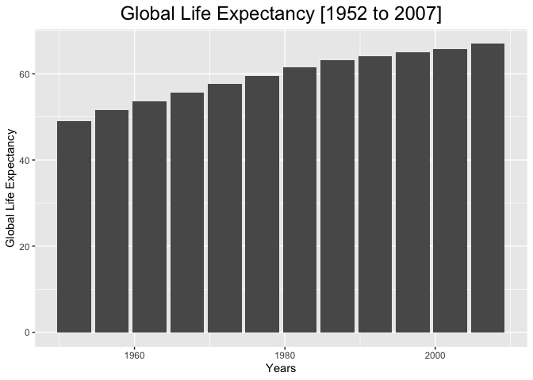
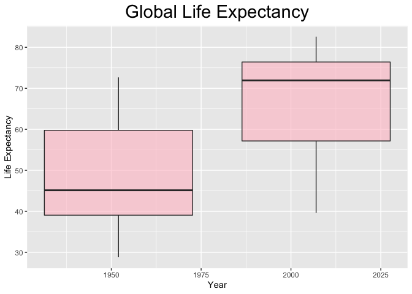
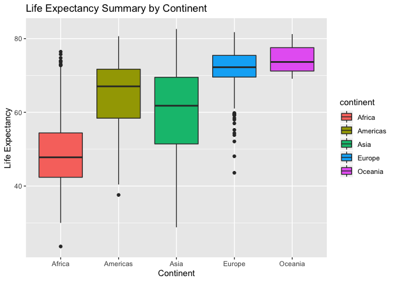
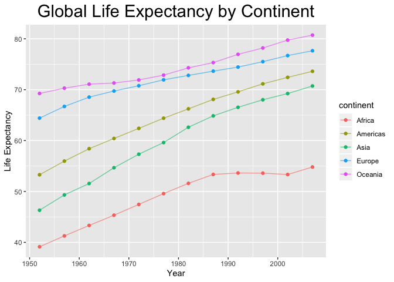
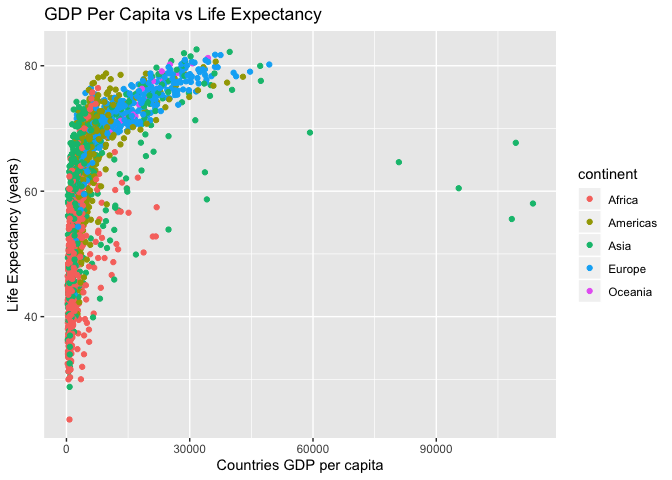
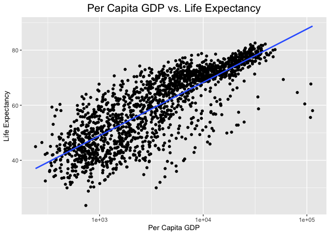
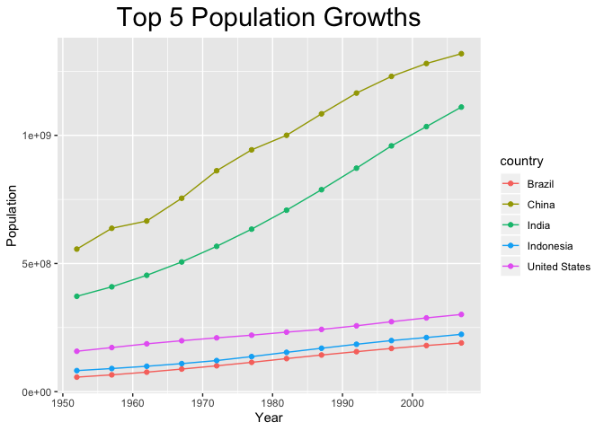
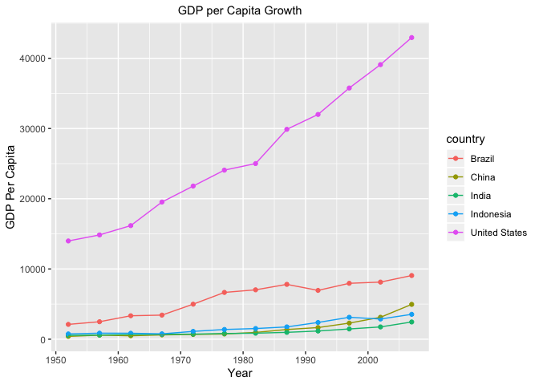

## Instructions
Answer the following questions and complete the exercises in RMarkdown. Please embed all of your code and push your final work to your repository. Your final lab report should be organized, clean, and run free from errors. Remember, you must remove the `#` for any included code chunks to run.  

## Libraries

```r
library(tidyverse)
```

```
## ── Attaching packages ──────────────────────────────────────────────────── tidyverse 1.3.0 ──
```

```
## ✓ ggplot2 3.2.1     ✓ purrr   0.3.3
## ✓ tibble  2.1.3     ✓ dplyr   0.8.4
## ✓ tidyr   1.0.2     ✓ stringr 1.4.0
## ✓ readr   1.3.1     ✓ forcats 0.4.0
```

```
## ── Conflicts ─────────────────────────────────────────────────────── tidyverse_conflicts() ──
## x dplyr::filter() masks stats::filter()
## x dplyr::lag()    masks stats::lag()
```

## Resources
The idea for this assignment came from [Rebecca Barter's](http://www.rebeccabarter.com/blog/2017-11-17-ggplot2_tutorial/) ggplot tutorial so if you get stuck this is a good place to have a look.  

## Gapminder
For this assignment, we are going to use the dataset [gapminder](https://cran.r-project.org/web/packages/gapminder/index.html). Gapminder includes information about economics, population, and life expectancy from countries all over the world. You will need to install it before use. This is the same data that we used for the practice midterm. You may want to load that assignment for reference.  

```r
#install.packages("gapminder")
library("gapminder")
```

## Questions
The questions below are open-ended and have many possible solutions. Your approach should, where appropriate, include numerical summaries and visuals. Be creative; assume you are building an analysis that you would ultimately present to an audience of stakeholders. Feel free to try out different `geoms` if they more clearly present your results.  

**1. Use the function(s) of your choice to get an idea of the overall structure of the data frame, including its dimensions, column names, variable classes, etc. As part of this, determine how NAs are treated in the data.**  

```r
str(gapminder)
```

```
## Classes 'tbl_df', 'tbl' and 'data.frame':	1704 obs. of  6 variables:
##  $ country  : Factor w/ 142 levels "Afghanistan",..: 1 1 1 1 1 1 1 1 1 1 ...
##  $ continent: Factor w/ 5 levels "Africa","Americas",..: 3 3 3 3 3 3 3 3 3 3 ...
##  $ year     : int  1952 1957 1962 1967 1972 1977 1982 1987 1992 1997 ...
##  $ lifeExp  : num  28.8 30.3 32 34 36.1 ...
##  $ pop      : int  8425333 9240934 10267083 11537966 13079460 14880372 12881816 13867957 16317921 22227415 ...
##  $ gdpPercap: num  779 821 853 836 740 ...
```


```r
dim(gapminder)
```

```
## [1] 1704    6
```


```r
colnames(gapminder)
```

```
## [1] "country"   "continent" "year"      "lifeExp"   "pop"       "gdpPercap"
```


```r
glimpse(gapminder)
```

```
## Observations: 1,704
## Variables: 6
## $ country   <fct> Afghanistan, Afghanistan, Afghanistan, Afghanistan, Afghani…
## $ continent <fct> Asia, Asia, Asia, Asia, Asia, Asia, Asia, Asia, Asia, Asia,…
## $ year      <int> 1952, 1957, 1962, 1967, 1972, 1977, 1982, 1987, 1992, 1997,…
## $ lifeExp   <dbl> 28.801, 30.332, 31.997, 34.020, 36.088, 38.438, 39.854, 40.…
## $ pop       <int> 8425333, 9240934, 10267083, 11537966, 13079460, 14880372, 1…
## $ gdpPercap <dbl> 779.4453, 820.8530, 853.1007, 836.1971, 739.9811, 786.1134,…
```


```r
nlevels(gapminder$country)
```

```
## [1] 142
```


```r
naniar::miss_var_summary(gapminder)
```

```
## # A tibble: 6 x 3
##   variable  n_miss pct_miss
##   <chr>      <int>    <dbl>
## 1 country        0        0
## 2 continent      0        0
## 3 year           0        0
## 4 lifeExp        0        0
## 5 pop            0        0
## 6 gdpPercap      0        0
```


```r
summary(gapminder)
```

```
##         country        continent        year         lifeExp     
##  Afghanistan:  12   Africa  :624   Min.   :1952   Min.   :23.60  
##  Albania    :  12   Americas:300   1st Qu.:1966   1st Qu.:48.20  
##  Algeria    :  12   Asia    :396   Median :1980   Median :60.71  
##  Angola     :  12   Europe  :360   Mean   :1980   Mean   :59.47  
##  Argentina  :  12   Oceania : 24   3rd Qu.:1993   3rd Qu.:70.85  
##  Australia  :  12                  Max.   :2007   Max.   :82.60  
##  (Other)    :1632                                                
##       pop              gdpPercap       
##  Min.   :6.001e+04   Min.   :   241.2  
##  1st Qu.:2.794e+06   1st Qu.:  1202.1  
##  Median :7.024e+06   Median :  3531.8  
##  Mean   :2.960e+07   Mean   :  7215.3  
##  3rd Qu.:1.959e+07   3rd Qu.:  9325.5  
##  Max.   :1.319e+09   Max.   :113523.1  
## 
```

**2. Among the interesting variables in gapminder is life expectancy. How has global life expectancy changed between 1952 and 2007?**

```r
Global_Life_Exp <- gapminder %>% 
  select(country, year, lifeExp) %>% 
  filter(year >= 1952 & year <=2007) %>% 
  group_by(year) %>% 
  summarise(lifeExp_avg = mean(lifeExp)) %>% 
  ggplot(aes(x= year, y= lifeExp_avg))+
  geom_bar(stat = "identity")+
  labs(title = "Global Life Expectancy [1952 to 2007]",
       x = "Years",
       y = "Global Life Expectancy")+
  theme(plot.title = element_text(size = 18, hjust = .5))

Global_Life_Exp
```

<!-- -->

**3. How do the distributions of life expectancy compare for the years 1952 and 2007? _Challenge: Can you put both distributions on a single plot?_**

```r
gapminder  %>%  
  filter(year %in% c(1952, 2007)) %>%
  select(year, lifeExp) %>% 
  group_by(year) %>% 
  summarize(min_lifeExp=min(lifeExp),
            max_lifeExp=max(lifeExp),
            mean_lifeExp=mean(lifeExp),
            median_lifeEx=median(lifeExp))
```

```
## # A tibble: 2 x 5
##    year min_lifeExp max_lifeExp mean_lifeExp median_lifeEx
##   <int>       <dbl>       <dbl>        <dbl>         <dbl>
## 1  1952        28.8        72.7         49.1          45.1
## 2  2007        39.6        82.6         67.0          71.9
```


```r
gapminder %>%
  filter(year %in% c(1952, 2007)) %>%
  ggplot(aes(x=year, y=lifeExp, group=year))+
  geom_boxplot(fill="pink", alpha=.6) +
  labs(title="Global Life Expectancy",
       x= "Year",
       y="Life Expectancy") +
  theme(plot.title = element_text(size = rel(2), hjust = 0.5))
```

<!-- -->

**4. Your answer above doesn't tell the whole story since life expectancy varies by region. Make a summary that shows the min, mean, and max life expectancy by continent for all years represented in the data.**

```r
gapminder %>% 
  group_by(continent) %>% 
  summarize(min_lifeExp = min(lifeExp),
            max_lifeExp = max(lifeExp),
            mean_lifeExp = mean(lifeExp))
```

```
## # A tibble: 5 x 4
##   continent min_lifeExp max_lifeExp mean_lifeExp
##   <fct>           <dbl>       <dbl>        <dbl>
## 1 Africa           23.6        76.4         48.9
## 2 Americas         37.6        80.7         64.7
## 3 Asia             28.8        82.6         60.1
## 4 Europe           43.6        81.8         71.9
## 5 Oceania          69.1        81.2         74.3
```


```r
gapminder %>% 
  ggplot(aes(x = continent, y = lifeExp, fill = continent)) +
  geom_boxplot() +
  labs(title = "Life Expectancy Summary by Continent",
       x = "Continent",
       y = "Life Expectancy")
```

<!-- -->

**5. How has life expectancy changed between 1952-2007 for each continent? Try using `geom_line()` for this, including all continents on the same  plot.**

```r
gapminder %>% 
  select(continent, year, lifeExp) %>% 
  group_by(continent, year) %>% 
    summarize(mean_lifeExp=mean(lifeExp))
```

```
## # A tibble: 60 x 3
## # Groups:   continent [5]
##    continent  year mean_lifeExp
##    <fct>     <int>        <dbl>
##  1 Africa     1952         39.1
##  2 Africa     1957         41.3
##  3 Africa     1962         43.3
##  4 Africa     1967         45.3
##  5 Africa     1972         47.5
##  6 Africa     1977         49.6
##  7 Africa     1982         51.6
##  8 Africa     1987         53.3
##  9 Africa     1992         53.6
## 10 Africa     1997         53.6
## # … with 50 more rows
```


```r
gapminder %>% 
  group_by(year, continent) %>% 
  summarize(mean_lifeExp=mean(lifeExp)) %>% 
  ggplot(aes(x=year, y=mean_lifeExp, color=continent))+
  geom_point() +
  geom_line(alpha=.6) +
  labs(title="Global Life Expectancy by Continent",
       x= "Year",
       y="Life Expectancy") +
  theme(plot.title = element_text(size = rel(2), hjust = 0.5))
```

<!-- -->

**6. We are interested in the relationship between per capita GDP and life expectancy; i.e. does having more money help you live longer?**

```r
gapminder %>% 
  select(country, continent, year, lifeExp, gdpPercap) %>%
  ggplot(aes(x=gdpPercap, y=lifeExp, color = continent))+
  geom_jitter()+
  labs(
    title= "GDP Per Capita vs Life Expectancy",
    x= "Countries GDP per capita",
    y= "Life Expectancy (years)")
```

<!-- -->

**7. There is extreme disparity in per capita GDP. Rescale the x axis to make this easier to interpret. How would you characterize the relationship?**

```r
gapminder %>% 
  ggplot(aes(x = gdpPercap, y = lifeExp,)) +
  geom_jitter() +
  scale_x_log10() +
  labs(title = "Per Capita GDP vs. Life Expectancy",
       x = "Per Capita GDP",
       y = "Life Expectancy") +
  theme(plot.title = element_text(size = rel(1.5), hjust = 0.5)) +
  geom_smooth(method = lm, se = F)
```

<!-- -->

**8. Which countries have had the largest population growth since 1952?**

```r
PopulationGrowth <- gapminder %>% 
  group_by(country) %>% 
  summarize(pop_growth = max(pop)-min(pop)) %>% 
  arrange(desc(pop_growth))
PopulationGrowth
```

```
## # A tibble: 142 x 2
##    country       pop_growth
##    <fct>              <int>
##  1 China          762419569
##  2 India          738396331
##  3 United States  143586947
##  4 Indonesia      141495000
##  5 Brazil         133408087
##  6 Pakistan       127924057
##  7 Bangladesh     103561480
##  8 Nigeria        101912068
##  9 Mexico          78556574
## 10 Philippines     68638596
## # … with 132 more rows
```

**9. Use your results from the question above to plot population growth for the top five countries since 1952.**

```r
gapminder %>%
  filter(country == "China" |
           country == "India" | 
           country == "United States" | 
           country == "Indonesia" |
           country == "Brazil") %>% 
  ggplot(aes(x=year, y=pop, color=country)) +
  geom_point() +
  geom_line() +
  labs(title = "Top 5 Population Growths",
       x= "Year",
       y= "Population") +
  theme(plot.title = element_text(size = rel(2), hjust = 0.5))
```

<!-- -->

**10. How does per capita GDP growth compare between these same five countries?**

```r
gapminder %>%
  filter(country == "China" |
           country == "India" | 
           country == "United States" | 
           country == "Indonesia" |
           country == "Brazil") %>% 
  ggplot(aes(x=year, y=gdpPercap, color=country)) +
  geom_point() +
  geom_line() +
   labs(title = "GDP per Capita Growth",
       x= "Year",
       y= "GDP Per Capita") +
  theme(plot.title = element_text(size = rel(1), hjust = 0.5))
```

<!-- -->

## Push your final code to GitHub!
Please be sure that you check the `keep md` file in the knit preferences. 
